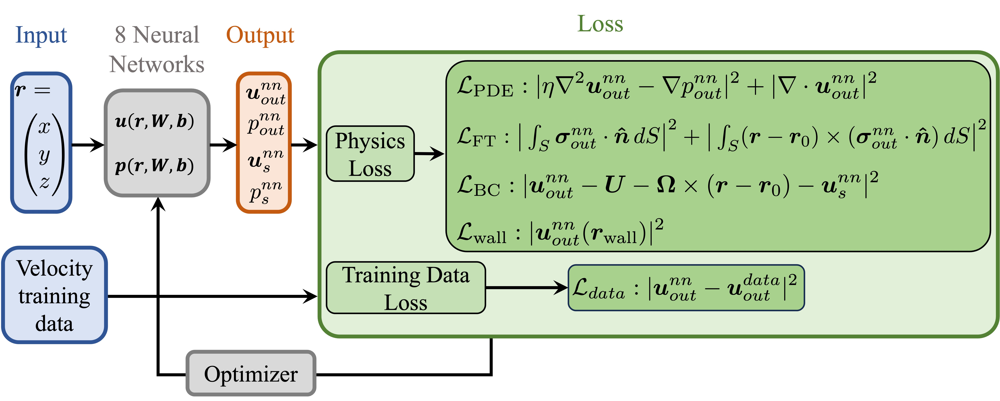
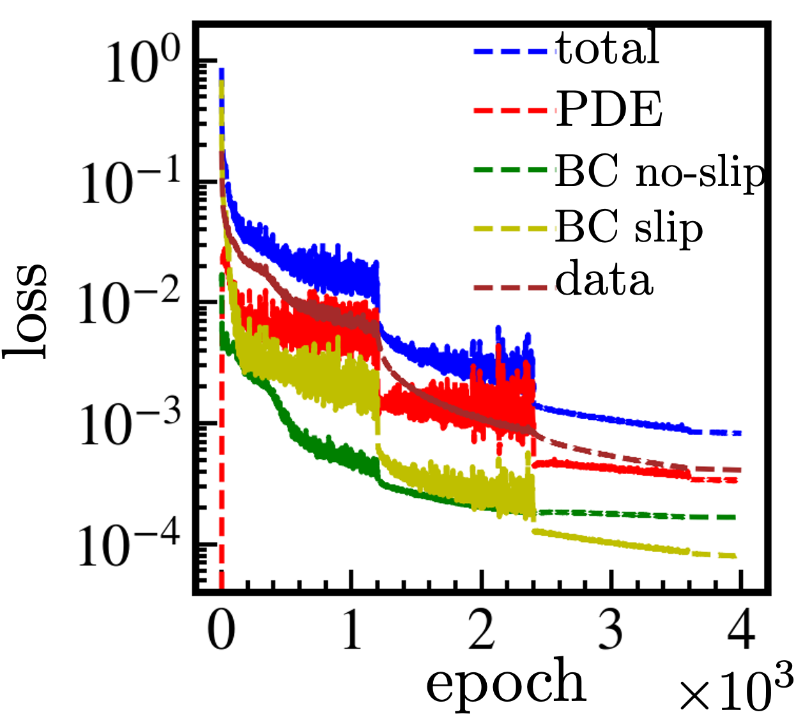
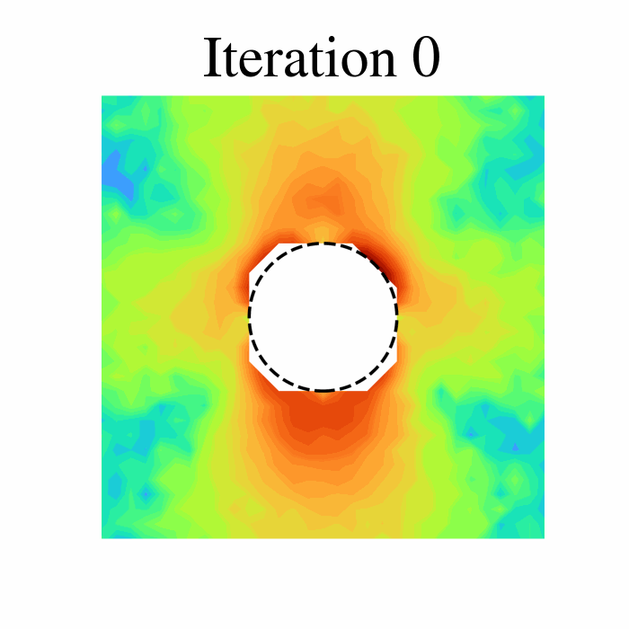
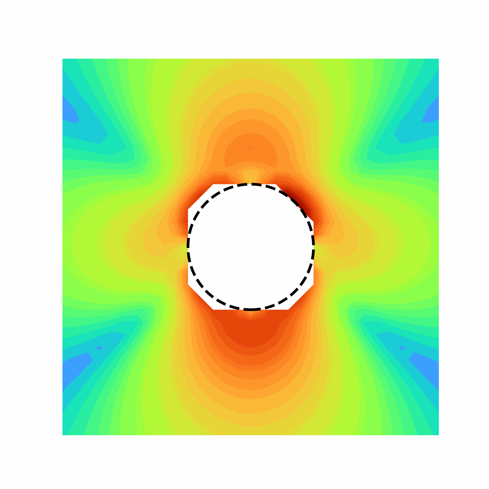
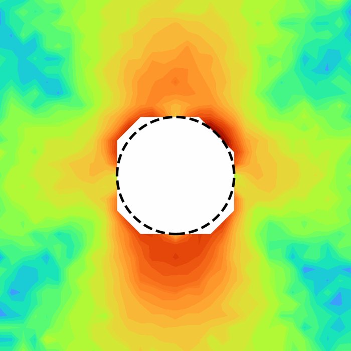

# Physics-Informed Neural Network to Solve Inverse Stokes Flow in Active Colloids

## Overview

This repository documents a Physics-Informed Neural Network (PINN) framework developed for solving inverse problems governed by the incompressible Stokes equations.

The framework combines sparse observational data with governing physical laws to reconstruct flow quantities such as slip velocity $u_s$ at the active particle surfaces that is hard to measure experimentally, while enforcing consistency with the underlying fluid dynamics.

The methodology is applicable to a variety of low-Reynolds-number flow problems, including microfluidics, soft matter systems, active matter, and interfacial hydrodynamics.

---

## Governing Equations

The model is based on the incompressible Stokes equations

$$
-\nabla p + \mu \nabla^2 \boldsymbol{u} = \boldsymbol{0}
$$

$$
\nabla \cdot \boldsymbol{u} = 0
$$

where

* $\boldsymbol{u}$ denotes the velocity field,
* $p$ denotes the pressure field,
* $\mu$ is the dynamic viscosity.

### Boundary Conditions

Fluid velocity on the active particle surface

$$\boldsymbol{u}|_{S} = \boldsymbol{U} + \boldsymbol{\Omega} \times (\boldsymbol{r}-\boldsymbol{r}_0) + \boldsymbol{u}_s$$

where $\boldsymbol{U}$ and $\boldsymbol{\Omega}$ are the translational and rotational velocities of the active particle and $\boldsymbol{u}_s$ is the slip velocity at the particle surface.

In case there is a solid boundaries present, the fluid velocity follows no slip conditions on the boundaries:

$$\boldsymbol{u}_{wall} = 0$$

---

## PINN Formulation

A neural network is trained to approximate the unknown solution fields.

The loss function combines:

* Data mismatch loss
* PDE residual loss
* Boundary condition loss

$$\mathcal{L} = \mathcal{L}_{Phys} + \lambda_{data} \mathcal{L}_{data}$$

where

$$\mathcal{L}_{Phys} = \mathcal{L}_{PDE} + \mathcal{L}_{BC} + \mathcal{L}_{wall}$$

Automatic differentiation is used to evaluate the derivatives appearing in the governing equations.

---

## Methodology

The workflow consists of:

1. Data preparation and normalization
2. Physics-informed neural network construction
3. Automatic differentiation of PDE residuals
4. Optimization of the composite loss function
5. Reconstruction of velocity and pressure fields
6. Predicting the velocity at the active particle surface
7. Validation against reference solutions

---

## Representative Results

### Network Architecture

### Training Algorithm

1. **Require:**
   - Eight neural networks, each predicting one output: exterior flow $u_{x,out}^{nn}, u_{y,out}^{nn}, u_{z,out}^{nn}, p_{out}^{nn}$ and surface/interface flow  $u_{x,s}^{nn}, u_{y,s}^{nn}, u_{z,s}^{nn}, p_{s}^{nn}$.
   - Training data: velocity values at training points.
   - Collocation points for PDE residual evaluation.
   - Boundary condition points.
   - Learning rate, batch size, and number of epochs.
   - Loss weight $\lambda_{data}$.

3. **Preprocessing**: Prepare training data and collocation points.
4. **Create Neural Networks**: Construct eight neural networks with 9 hidden layers and 128 neuron per layer
5. **Initialize optimizer and learning-rate scheduler.**
6. **For** $$epoch = 1, \dots, epoch_{\text{total}}$$
7.    - Initialize losses: $$\text{loss} = 0$$.
8.    - **For** each batch $$(x, y, z)$$ from PDE points
         - Zero gradients of network parameters $$W$$ and $$b$$.
         - Predict velocity and pressure fields.
         - Compute total loss: $$L =  L_{phys} + \lambda_{data} L_{data}$$.
         - Compute gradients: *loss.backward()*.
         - pdate $W$ and $b$ using *optimizer.step()*.
         - Accumulate batch losses.
         
19. - **EndFor**
   
20. - Record total loss for this epoch.
      
21. - Update the learning rate using the scheduler.
      
22. - Save model weights and loss values for diagnostics.
      
23. **EndFor**
24. **Save final trained parameters $W$ and $b$**
25. **Prediction:** Apply the trained model on test data points to predict the velocity.

### Predicted Velocity Field and Slip Velocity

Comparison of PINN-predicted (blue) and BEM (pink) flow fields in the $yz$-plane for squirmer and phoretic Janus particles in the laboratory frame.
Panels (a,c) show unbounded cases: a puller squirmer with $\beta_s = 5$ and a Janus particle with $\beta_p = -10$.
Panels (e,g) show corresponding near-wall configurations, with the particle centered at $z_0/a = 2$; the squirmer is oriented normal to the wall, and the Janus particle is oriented at $\mathrm{rot}_x = \pi/3$.
Panels (b,f) report the surface slip velocity for squirmers with $\beta_s =\{-5, 0, 5\}$, and panels (d,h) report slip velocities for Janus particles with $\beta_p = \{-10, 1, 10\}$.
In all cases, open symbols denote PINN results and filled symbols denote BEM predictions.
For the squirmer, solid curves in panels (b,f) show the analytical slip distribution used as reference.
Velocities are normalized by the swimming speed $|U|$.

### Convergence History (loss values)

Loss history of the case of a Janus particle with $\beta_p = -10$ near a wall with the particle centered at $z_0/a = 2$ and oriented at $\mathrm{rot}_x = \pi/3$.

---

### PINN Convergence vs. BEM Reference (fluid flow)

   
   

<b>Left:</b> PINN convergence &nbsp;&nbsp;&nbsp;&nbsp;
<b>Right:</b> noisy training data  &nbsp;&nbsp;&nbsp;&nbsp;
<b>Right:</b> BEM reference

---

## Publication

The scientific results associated with this work are available in:

https://arxiv.org/abs/2511.22723

---

## Code Availability

The implementation is not publicly distributed. This repository documents the methodology, architecture, and representative results of the PINN framework.

---

## Research Areas

* Physics-Informed Neural Networks (PINNs)
* Scientific Machine Learning
* Inverse Problems
* Stokes Flow
* Computational Fluid Dynamics
* Soft Matter Physics
* Active Matter
* Scientific Computing
